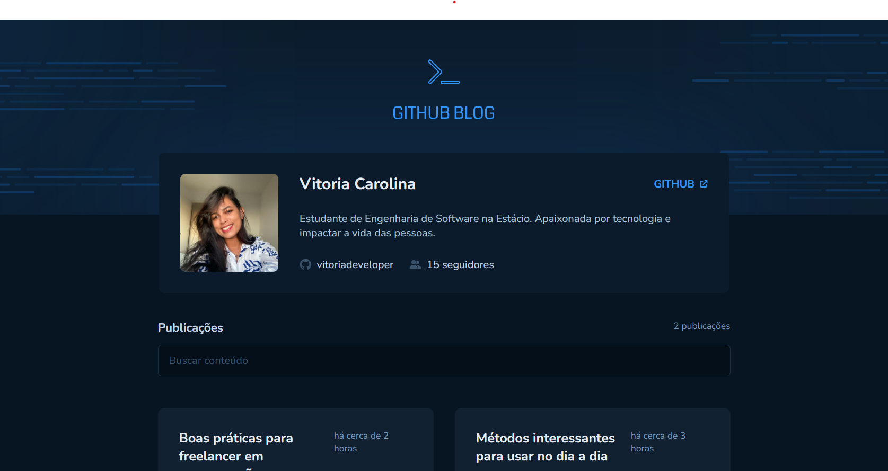
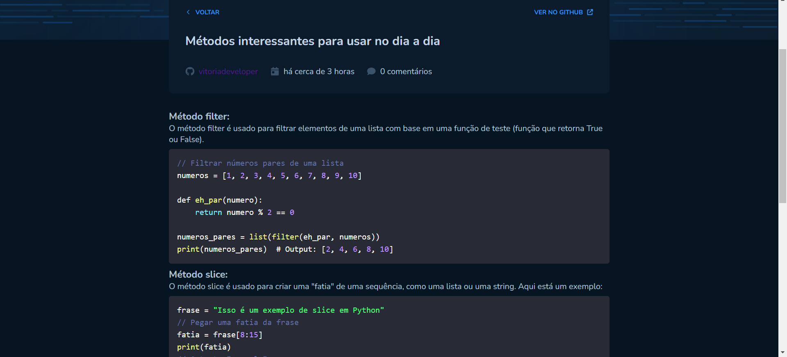

# Bem vindos ao meu Github Blog

Primeiramente gostaria de apresentar o projeto, trata-se de um desafio proposto pela trilha React do curso de Ignite da <a href="https://www.rocketseat.com.br/">RocketSeat</a> em que consiste em desenvolver um blog com integração com a API do GITHUB

Na página Home temos a apresentação do Perfil, Bio e imagem como mostra a figura abaixo, temos a listagem das issues do repositório e temos a opção de buscar uma issue específica.

 

####  Ao digitar no campo, espera-se que a issue seja exibida em tela com base no texto digitado

####  Note que após digitar no campo, a issue que contem o título com a palavra mencionada, foi exibida em tela, note também que o valor de publicações encontradas foi atualizado.

####  Ao clicar na issue, você será redirecionado para o post em questão, note que ele ja encontra-se formatado.

### Tecnologias utilizadas 
 
 
 

 #### Outras Tecnologias
- Styled Components
- Zod
- React-markdown (para formatar texto de ReadME)
- Date-fns (Para formatar data)
---
#### Hooks utilizados
- UseContext
- UseState
- UseEffect
- UseForm
- Use-context-selector

#### Espero que tenham, me sigam nas minhas redes socias

  
